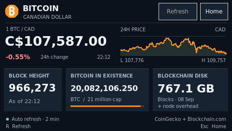

# Bitcoin Dashboard

A lightweight Bitcoin dashboard for the PocketCHIP's **480 × 272** display,
built with Python and Tkinter. Current native package version: **1.2.3**.

[Changelog](CHANGELOG.md) · [Native package contract](../../docs/creating-apps.md)



## Features

- Bitcoin price in Canadian dollars, 24-hour change, and a price chart.
- Latest reported block height, circulating supply, and dated blockchain size.
- Tap any network card, or select it with the arrow keys and press Enter, for details.
- Optional ten-second **NEW BLOCK** highlight with a persistent Settings toggle.
- Background refreshes, retries, and saved-data indicators during network outages.
- High-contrast touch controls and RAM session caching to reduce flash writes.

Market data comes from CoinGecko; network statistics come from Blockchain.com.
This is a dashboard—it does not download the blockchain.

## Native package and runtime

This package uses manifest v1, stable ID `io.vitrallis.bitcoindashboard`, runtime
`python` and entry `main.py`. Requires Python **3.8+**, system Tkinter with
**Tk 8.6**, and a graphical desktop on Linux/macOS. There are no pip dependencies;
Tkinter is a system prerequisite (on Debian: `sudo apt install python3-tk`).
The PocketCHIP profile uses 480×272 and DejaVu Sans fonts.

From the Vitrallis-Apps repository root:

```sh
python3 apps/bitcoin-dashboard/main.py
```

An absolute path works from any working directory. The packaged `icon.png` is
resolved relative to the script. Importing the module does not start the GUI,
fetch data or write files. Close the app with Home or Escape to return to its
launcher. Installed package files are read-only.

Use the [native publication workflow](../../docs/publishing-apps.md) for updates.
Catalog installation remains disabled until a native installer and launcher are
verified; this package does not include a runtime or installation script.

### Permissions and storage

- **Network: true.** Fetches public HTTPS market and network data from CoinGecko
  and Blockchain.com. An optional `COINGECKO_DEMO_API_KEY` is sent only to CoinGecko.
- **Storage: true.** Settings are saved to
  `~/.config/pocket-bitcoin/settings.json` only when the highlight toggle changes.
  Session data is cached at `/run/user/<uid>/pocket-bitcoin.json` using private,
  atomic writes when that directory is available and safe. These are the app's
  existing private storage locations, separate from the installed package.
  No alternate cache path or older cache-format conversion is used.
- **Audio: false.** No audio is used.

Permissions declare requirements; they are not a sandbox. Storage failure leaves
settings in memory with a notice, while network failure keeps valid in-memory
samples and retries. See [development details](docs/development.md).

## Controls

| Control | Action |
| --- | --- |
| Refresh / R | Request fresh data when the cooldown allows |
| Settings / S | Open or close Settings |
| Tab / Shift+Tab | Move keyboard focus; cycle within Settings while open |
| Arrow keys | Select a dashboard card (Left/Up backward, Right/Down forward) |
| Enter / Space | Open the selected card or activate a focused control |
| Back | Return from card details to the dashboard |
| Home | Close the app |
| Escape | Close Settings first, then card details, otherwise close the app |

The block card turns green for **10 seconds** when a fresh sample reports a higher
block height. Repeated samples and navigation do not extend the highlight. Detection follows the network refresh schedule rather than a live stream.
Settings persist across launches; a save failure is shown in the panel.
Unreadable settings use the default and show a notice in Settings. Missing data
is labelled unavailable; retained older values are labelled saved. Connection,
rate-limit, malformed-data, and certificate errors appear in the status line
while the app retries automatically. Refresh cooldowns prevent repeated requests.

Card details include subsidy and halving progress, full eight-decimal BTC and
satoshi supply totals, and blockchain size in GB/MB with node-storage context.
Details update with the dashboard data and show loading, unavailable, or saved
status. Tap **Back** or press **Escape** to return to the selected card.

## Data and development

See [data sources, refresh timing, cache behavior, and tests](docs/development.md)
for technical details. The [changelog](CHANGELOG.md) records changes by version.
The manifest is the publication metadata source. Keep the UI/user-agent version
in `main.py` aligned; package tests enforce this without making app startup
depend on the tooling's Python 3.11+ TOML parser.

Report problems in
[GitHub Issues](https://github.com/csd113/Vitrallis-Apps/issues),
including the app version and any error message.
