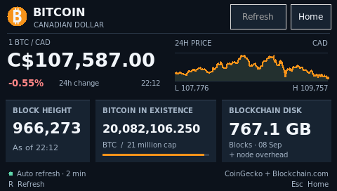

# Bitcoin Dashboard

A lightweight Bitcoin dashboard for the PocketCHIP's **480 × 272** display,
built with Python and Tkinter. Current native package version: **1.3.0**.

[Changelog](CHANGELOG.md) · [Native package contract](../../docs/creating-apps.md)



## Network and watch pages

The default page uses mempool.space mainnet data: latest block height, block
transaction count/size, recommended fee rates and mempool count/virtual size.
N opens Network, W opens Watch, and the CAD chart button (or Escape) returns to
the preserved CAD chart. Tab/Shift+Tab reaches all controls; Enter/Space activates
them. In Watch, Up/Down selects an address. Add/Edit provides ordinary text
entries and keyboard Save/Cancel controls; deletion requires pressing Sure?.
The legacy chart's Settings and card shortcuts remain available on that page.
Global shortcuts do not intercept letters while typing labels or addresses.

Watch up to eight public mainnet addresses, each with a 1–24 character label,
confirmed and pending balances in exact satoshis, three recent transaction
summaries (confirmed/pending and net address movement), and last successful
refresh time. Address validation checks Base58Check or Bech32/Bech32m checksums,
witness versions/lengths and mainnet prefixes before saving or requesting data.
The watch list lives in `~/.config/pocket-bitcoin/watch.json`, written atomically
only on edits. An unreadable list is preserved and edits are blocked until repaired.
Balance/activity caches are bounded to watched addresses and live only in RAM.

This is strictly watch-only. It never handles private keys, seed phrases, wallet
passwords, signing or transaction submission. The data service sees the requested
public address; labels stay local. Refresh covers the network and currently
selected watch only, avoiding requests for unseen addresses. R requests a refresh
subject to a 20-second minimum and error backoff. Automatic refresh is every five
minutes, with exponential failure delays capped at 30 minutes. One worker keeps
Tk responsive; cached successful values survive errors and show their timestamp.
Requests have connection/read timeouts, a response deadline and a 1 MB size cap;
a refresh stops starting new requests after a 60-second work budget. Workers are
daemons and stop starting requests after close; an in-flight timed request may
finish afterward without delaying application exit. Hidden pages do not poll APIs.

The API endpoints are `/api/v1/blocks`, `/api/v1/fees/recommended`, `/api/mempool`,
`/api/address/:address` and `/api/address/:address/txs`. Contracts were checked
against [official mempool routes](https://github.com/mempool/mempool/blob/master/backend/src/api/bitcoin/bitcoin.routes.ts)
and [Esplora](https://github.com/Blockstream/esplora/blob/master/API.md).

## Shared Tor / Arti

The package requests Shell Tor with `[network] tor = "preferred"`. With the
Shell's API-v1 environment present, all API traffic (including legacy providers)
uses the existing loopback SOCKS5 service at 127.0.0.1:9150, with destination DNS
resolved by Tor and normal TLS certificate verification. Invalid/unavailable Tor
configuration or a failed proxy request fails cleanly without direct fallback.
The page names the selected route and shows errors; a connected launch snapshot
is not a promise that future requests work. No Tor is bundled or started here.
Without a Shell Tor contract (standalone launch), requests use ordinary HTTPS.
For fail-closed launch isolation, a maintainer can select `tor = "required"`
following Shell's Bubblewrap contract; this changes shipped metadata and needs
its own version/publication. Real Arti and PocketCHIP verification remain required.

## Preserved CAD chart features

- Bitcoin price in Canadian dollars, 24-hour change, and a price chart.
- Latest reported block height, circulating supply, and dated blockchain size.
- Tap any network card, or select it with the arrow keys and press Enter, for details.
- Optional ten-second **NEW BLOCK** highlight with a persistent Settings toggle.
- Background refreshes, retries, and saved-data indicators during network outages.
- High-contrast touch controls and RAM session caching to reduce flash writes.

The primary network/watch pages use mempool.space. The preserved CAD chart
uses CoinGecko and its legacy supply/size cards use Blockchain.com.
This is a dashboard—it does not download the blockchain.

## Native package and runtime

This package uses manifest v1, stable ID `io.vitrallis.bitcoindashboard`, runtime
`python` and entry `main.py`. Requires Python **3.8+**, system Tkinter with
**Tk 8.6**, and a graphical desktop on Linux/macOS. There are no pip dependencies;
Tkinter is a system prerequisite (on Debian: `sudo apt install python3-tk`).
The PocketCHIP profile uses 480×272 and DejaVu Sans fonts.

From the Vitrallis-Apps repository root:

```sh
python3 apps/bitcoin-dashboard/main.py
```

An absolute path works from any working directory. The packaged `icon.png` is
resolved relative to the script. Importing the module does not start the GUI,
fetch data or write files. Close the app with Home or Escape to return to its
launcher. Installed package files are read-only.

Use the [native publication workflow](../../docs/publishing-apps.md) for updates.
See the current [runtime integration guide](../../docs/runtime-integration.md)
for catalog enablement, App Center actions and recorded device checks. This package
does not include a runtime or installation script.

### Permissions and storage

- **Network: true.** Fetches public HTTPS market and network data from CoinGecko
  and Blockchain.com. An optional `COINGECKO_DEMO_API_KEY` is sent only to CoinGecko.
- **Storage: true.** Settings are saved to
  `~/.config/pocket-bitcoin/settings.json` only when the highlight toggle changes.
  Session data is cached at `/run/user/<uid>/pocket-bitcoin.json` using private,
  atomic writes when that directory is available and safe. These are the app's
  existing private storage locations, separate from the installed package.
  No alternate cache path or older cache-format conversion is used.
- **Audio: false.** No audio is used.

Permissions declare requirements; they are not a sandbox. Storage failure leaves
settings in memory with a notice, while network failure keeps valid in-memory
samples and retries. See [development details](docs/development.md).

## Controls

| Control | Action |
| --- | --- |
| Refresh / R | Request fresh data when the cooldown allows |
| Settings / S | Open or close Settings |
| Tab / Shift+Tab | Move keyboard focus; cycle within Settings while open |
| Arrow keys | Select a dashboard card (Left/Up backward, Right/Down forward) |
| Enter / Space | Open the selected card or activate a focused control |
| Back | Return from card details to the dashboard |
| Home | Close the app |
| Escape | Close Settings first, then card details, otherwise close the app |

The block card turns green for **10 seconds** when a fresh sample reports a higher
block height. Repeated samples and navigation do not extend the highlight. Detection follows the network refresh schedule rather than a live stream.
Settings persist across launches; a save failure is shown in the panel.
Unreadable settings use the default and show a notice in Settings. Missing data
is labelled unavailable; retained older values are labelled saved. Connection,
rate-limit, malformed-data, and certificate errors appear in the status line
while the app retries automatically. Refresh cooldowns prevent repeated requests.

Card details include subsidy and halving progress, full eight-decimal BTC and
satoshi supply totals, and blockchain size in GB/MB with node-storage context.
Details update with the dashboard data and show loading, unavailable, or saved
status. Tap **Back** or press **Escape** to return to the selected card.

## Data and development

See [data sources, refresh timing, cache behavior, and tests](docs/development.md)
for technical details. The [changelog](CHANGELOG.md) records changes by version.
The manifest is the publication metadata source. Keep the UI/user-agent version
in `main.py` aligned; package tests enforce this without making app startup
depend on the tooling's Python 3.11+ TOML parser.

Report problems in
[GitHub Issues](https://github.com/csd113/Vitrallis-Apps/issues),
including the app version and any error message.
