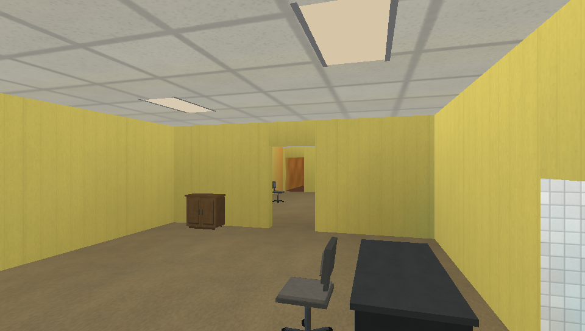
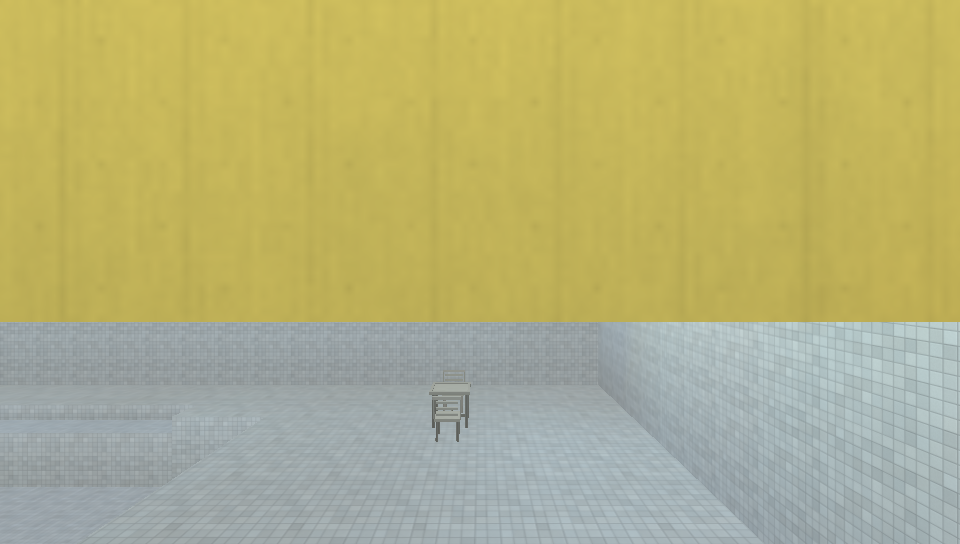
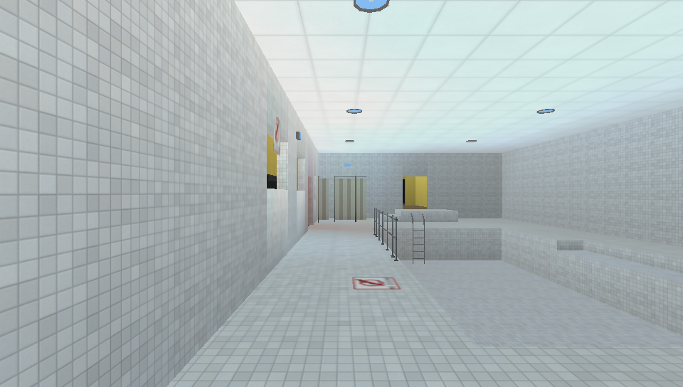
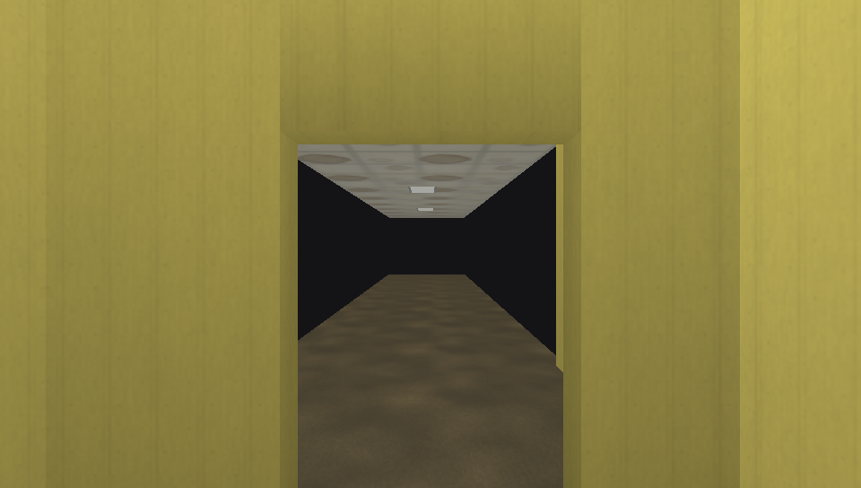

# Places

### an experience

A slow first-person exploration game. You walk through quiet, over-lit
institutional interiors — an office that keeps going, a swimming pool that is
closed and empty — and the building stops being finished around you. There is
nothing to collect, fight or solve.

> **This copy is the PocketCHIP edition.** It is built for one device — an
> Allwinner R8 with a single Cortex-A8 and a Mali-400 MP1 — and it is neither
> the source of the published desktop package (`apps/liminal-rust`) nor a
> desktop build that happens to run on a handheld. The renderer, the runtime
> profile and the build configuration are chosen for that hardware, and
> anything whose only purpose was a larger machine has been removed.
> [docs/POCKETCHIP.md](docs/POCKETCHIP.md) is the target document, with the
> measured reasoning behind every shipped setting and the
> cross-compilation workflow. The published desktop package lives at
> `apps/liminal-rust`.

Places is written in Rust: `sdl2` for the window and input,
OpenGL through `glow`, and a baked-lighting renderer with no dynamic shadow
maps. Every fixture bakes into a lightmap atlas for static geometry, props
occlude the bake, and emission, transparency and atmospheric fog are all
authored as content. Its content is
data: levels are JSON, surfaces are PNGs, props are GLBs, and a catalog maps
stable logical ids onto all of it.



## Overview

The engine is deliberately small and the content is deliberately editable:

* **Rooms, walls and openings** are authored as rectangles in a JSON level.
  Walls can be cut with doors, windows, passages and vents.
* **Baked RGB lighting, now as real lightmaps.** Every fixture bakes a room
  baseline plus a local pool, exactly as before, but the result is stored per
  *texel* in a lightmap atlas for static floors, ceilings, walls and skirts — so
  a fixture reads as a pool of light with a soft edge instead of a plateau.
  Coloured fixtures tint both the visible panel and the illumination. The old
  per-vertex bake remains as an exact fallback.
* **Props occlude the light.** A placed prop's own geometry joins the bake, so
  the floor under a machine darkens, a fridge blocks the pool behind it and
  furniture grounds itself against the wall it stands on — with nothing to
  author.
* **A separate dynamic-object path.** Objects whose transform changes every
  frame render outside the static batches and the bake: upload the model once,
  pass a transform per object, probe the baked light at its position. Moving one
  never rebuilds geometry, batching or lightmaps.
* **Partitions split the baseline.** When an opaque internal wall divides a
  room's footprint, each side gets its own baseline from the fixtures it can
  reach; a doorway still blends a bounded amount through its aperture, and a
  wall that stops short of the ceiling is not a partition. An open room bakes
  exactly as it always did.
* **Walls are lighting boundaries.** A fixture's light only reaches what its
  panel can see: an opaque wall blocks the pool behind it, and a doorway,
  window, passage or vent transmits light through exactly the hole it cuts.
* **Floors and ceilings are boundaries too.** Stacked rooms do not light each
  other through a solid slab, in colour or brightness, while a raised platform,
  a lowered basin and an intentional vertical opening stay open. A ceiling
  fixture on a chosen storey authors a world `y`.
* **Vertical geometry.** A room has its own floor elevation, clear height and
  ceiling profile (flat or gable); `floor_regions` recess or raise rectangular
  parts of a room, which is how the empty pool basin and the region staircases
  are built.
* **External artwork.** Surface materials, decal sheets, light fixture faces and
  (optionally) level pack textures are ordinary PNGs under `assets/`. Replace
  the file, restart, see the new pixels — no Rust change and no recompilation.
* **A real catalog.** Levels never store a file path. They name a logical id
  (`core:desk`, `core:pool_tile_deck_01`, `spooner-man`) and `assets/catalog.json`
  resolves it to a file, a material definition or a generated resource.
* **Atmospheric fog.** Exponential-squared distance fog with a mild height term,
  mixed in the world fragment stage: about 4 % at 20 m, 15 % at 40 m and 63 % at
  the far plane, a little denser near the floor. It costs no pass. The handheld
  profile evaluates the same curve without a transcendental.
* **Animated emissions.** A level can make a material's emission `pulse` or
  `flicker`, deterministically and within a bounded depth — a backlit sign
  breathing, a tube on a failing ballast.

## Screenshots

| | |
| --- | --- |
|  Office: warm fluorescent panels over carpet and printed wallpaper, with the pool windows on the right. |  The office looks one storey down into the pool through a window aperture. |
|  The stair hall turns red; the pool is visible through both a passage and a window beside it. |  The empty pool: recessed basin, ladder, guardrails, patio set, NO DIVING sign, cool light. |
|  The last doorway frames the unmade world. |  Beyond it: a floor, a ceiling, a few fixtures, and nothing. |

## The demo

`assets/levels/places_demo.json` is the official showcase. It is one continuous
route through everything the project currently does:

```text
office reception  →  workroom  →  doorways and windows
      →  red stair hall (1.5 m down)  →  pool hall (recessed basin)
      →  two steps up  →  quiet corridor  →  final doorway  →  the unmade world
```

Walk it from the main menu, or boot straight into it:

```sh
cargo run                                   # then: Level Select → Places Demo
LIMINAL_LEVEL=places_demo cargo run         # straight into the demo
LIMINAL_LEVEL=places_demo ./Places/places    # from a packaged build
```

Route, if you want it: from the spawn, walk forward through the doorway into the
workroom, keep straight through the second doorway and down the stairs, follow
the passage into the pool hall, cross the deck to the far side, and take the two
steps up into the dim corridor. The doorway at its end is the last one.

## Controls

Menus use `W`/`S` to move through items, `ENTER` to activate and `ESC` to go
back; a Settings value uses `A`/`D` (or `ENTER`) to change it.

Settings is organized into three sections — **Graphics**, **Display** and
**Controls** — reached from either the main menu or the pause menu, so the game
can be reconfigured without leaving a level.

Gameplay defaults (all eight movement bindings can be changed in Settings →
Controls; `Restore Defaults` puts them back):

| Action | Key |
| --- | --- |
| Walk forward | `W` |
| Walk backward | `S` |
| Strafe left | `A` |
| Strafe right | `D` |
| Look up | `UP` |
| Look down | `DOWN` |
| Look left | `LEFT` |
| Look right | `RIGHT` |
| Pause menu | `ESC` (fixed) |
| Performance overlay | `-` (fixed, hidden by default) |

Graphics and display preferences, custom bindings, look speed, walk speed,
field of view and look inversion are saved to `settings.json` in the package
root and kept across launches. A fresh installation opens full screen at
480 × 272 — the device's own panel — with the handheld quality profile;
settings written by an earlier version load unchanged. Changes apply
immediately: Graphics Quality, Lightmaps, VSync, Texture Filtering, Window Mode,
Resolution, sensitivity, look inversion and bindings all take effect without
restarting or reloading the level. See [Rendering notes](#rendering-notes) for
what each option changes.

Bloom and reflections are **not** options here: the stages they controlled are
removed, not disabled. The offscreen render target they needed is what the
Lima driver faults on, and the target is gone with them.


## Build and run

### Build for the PocketCHIP

The device has no compiler, so Places is cross-compiled against an ARM sysroot
built from the device's own Debian distribution. The full recipe, including how
to build the sysroot and how to deploy the result, is in
[docs/POCKETCHIP.md](docs/POCKETCHIP.md); in short:

```sh
rustup target add armv7-unknown-linux-gnueabihf
export PKG_CONFIG_ALLOW_CROSS=1
export PKG_CONFIG_PATH=~/chip-sysroot/usr/lib/arm-linux-gnueabihf/pkgconfig
export PKG_CONFIG_SYSROOT_DIR=~/chip-sysroot
cargo zigbuild --release --target armv7-unknown-linux-gnueabihf
```

`.cargo/config.toml` selects `target-cpu=cortex-a8` for ARM targets only, so a
desktop build of the same source is unaffected. Do not use `target-cpu=native`.

For a quick look on a development machine you still need SDL2 and
`pkg-config` (on macOS, `brew install sdl2 pkg-config`); `cargo run` then works
as it always did.

`cargo run` resolves `assets/`, `levels/` and `settings.json` from the
repository root, and also from the executable's own directory, so running the
game from a subdirectory works too. A compiled build locates its payload from
its own path and does not depend on the working directory at all.

A first launch is self-initializing: the game creates the drop-in `levels/` and
`import/` directories and writes a default `settings.json` next to its payload
(or below `$LIMINAL_STATE_ROOT` when that is set), so nothing has to be prepared
by hand. Places Demo is always available, even if no asset tree and no level
files exist at all. Normal startup prints nothing; `LIMINAL_VERBOSE=1` turns the
developer telemetry (package/asset/level/lighting/build lines) back on for a
run. Genuine problems — a missing asset root, a skipped level file, an
unresolved material — are always reported, once each.

Validate the project:

```sh
cargo fmt --all --check
cargo clippy --workspace --all-targets --all-features -- -D warnings
cargo test --workspace --all-features
python3 tools/assets/validate.py          # catalog, resources, shipped + fixture levels
python3 tools/textures/build.py --check   # surface, decal and fixture PNGs and their budgets
python3 tools/props/build.py --check      # prop models exist and fit their budgets
cargo build --release && python3 -m unittest tests.test_compiled_build
                                          # the compiled executable: fresh install,
                                          # packaged layout, first-run state, config
                                          # reload, malformed content, clean exit
cd level-editor && npm test               # the legacy level editor still parses the catalog
```

## Distribution layout

A packaged build is a directory with the executable and its payload:

```text
Places/
    places                  the executable
    assets/                 catalog.json, levels/, models, textures, decals
        catalog.json
        levels/places_demo.json
        core/ environment/ entities/ diagnostic/
    levels/                 drop-in level packs (*.json and *.zip); created on first run
    import/                 files waiting to be imported; created on first run
    settings.json           written on first run
    cache/                  lightmap cache; created on demand
```

Build one with:

```sh
cargo build --release
tools/package.sh                  # -> target/package/Places and target/package/Places.app
```

`tools/package.sh` also writes the macOS bundle form,
`Places.app/Contents/MacOS/places` with the same payload under
`Contents/Resources/`. Both forms run from any working directory. The asset root
is resolved in this order and the result is printed at startup:

```text
$LIMINAL_ASSET_ROOT                    explicit override (the directory containing assets/)
exe_dir, exe_dir/.. .. exe_dir/../../..   a flat install, and the legacy bin/<triple>/app layout
exe_dir/../Resources                   a macOS .app bundle
assets, ./assets, ../assets            the working directory (development)
$CARGO_MANIFEST_DIR/assets             development builds only, never a release binary
```

A release binary therefore cannot read the source tree it was built from, and a
missing asset root is reported loudly with the full list of locations checked
rather than silently degrading. `assets/levels/` is scanned for shipped levels
and `levels/` for drop-in ones; both appear in the same Level Select menu. The
writable side — `settings.json`, `levels/`, `import/` and `cache/` — always
lives below the package root (the parent of `assets/`), or below
`$LIMINAL_STATE_ROOT` when that is set, never in whatever directory the process
happens to be started from.

## Assets, themes and ids

`assets/catalog.json` is the authoritative registry. Levels reference **logical
ids**, never paths, so a file can move without editing a level. There are two
environment themes, `office` and `pool`; themes document and group content and
never restrict placement — an Office fixture may light a Pool room and an entity
may stand anywhere.

| Office | id |
| --- | --- |
| Wallpaper (maintained / damaged) | `core:wallpaper_yellow_01` / `core:wallpaper_stained_01` |
| Carpet (maintained / damp) | `core:carpet_beige_01` / `core:carpet_damp_01` |
| Suspended ceiling (maintained / stained) | `core:ceiling_panel_01` / `core:ceiling_stained_01` |
| Fluorescent ceiling panel | `core:fluorescent_panel_01` |
| Desk, chair, cabinet, water cooler, vending machine | `core:desk`, `core:chair`, `core:cabinet`, `core:water_cooler`, `core:vending_machine` |

| Pool | id |
| --- | --- |
| Deck, basin, wall tile, ceiling | `core:pool_tile_deck_01`, `core:pool_tile_basin_01`, `core:pool_tile_wall_01`, `core:pool_ceiling_01` |
| Patio table / chair | `core:pool_table`, `core:pool_chair` |
| Curtain (straight / end / corner) | `core:pool_curtain_straight`, `core:pool_curtain_end`, `core:pool_curtain_corner` |
| Ladder | `core:pool_ladder` |
| Guardrail (straight / end / corner) | `core:pool_guardrail_straight`, `core:pool_guardrail_end`, `core:pool_guardrail_corner` |
| Round downlight / wall luminaire | `core:pool_light_round`, `core:pool_light_wall` |
| NO DIVING sign | `core:decal_no_diving_01` |

Generic props (`core:couch`, `core:bed`, `core:table`, appliances, …) carry no
theme and are used by the official demo. `spooner-man` is an `entity`, not
a prop, and places through the same system.

### Textures and materials

A level names a *material*; the catalog maps that material to a *texture* asset
that owns the PNG, plus a world-space tiling period and a static tint. Replace
the PNG under `assets/environment/<theme>/textures/` (or a decal sheet under
`assets/environment/pool/decals/`, `assets/core/decals/`, or a light fixture's
face under `assets/environment/<theme>/textures/lights/`) and restart the game.

Every surface, decal and fixture PNG is an ordinary editable file; the ones
under `tools/` regenerate the shipped set deterministically, but hand-painted
artwork is just as valid. Add a new surface material without touching Rust: add
the PNG, add a `texture` entry and a `material` entry to the catalog, then name
the material from a level. A material may also name a `normal_texture` (a
tangent-space normal map, generated or hand-painted like any other sheet), a
`specular` strength and a `shine` glossiness for its sheen (a level may override
the glossiness per surface), and an `alpha_mode` with an optional `opacity` for
translucency. A light fixture's *mesh* is still code, but its face
is the PNG its catalog entry names. `assets/README.md` documents the catalog
format, the material/texture split and the asset budgets.

**Colour space.** The renderer has no gamma handling: textures are sampled as
authored and multiplied by a display-space baked shade. That is deliberate — the
shipped artwork, the material tints and every lighting constant were calibrated
together in that space. See "Rendering notes" below.

## Levels and creator content

A level is a JSON document. Rooms are rectangles with an optional numeric floor
elevation, a clear height and a ceiling profile; walls are rectangles with
optional per-face materials and openings cut out of them.

```jsonc
{
  "format_version": 1,
  "id": "my_level",
  "name": "My Level",
  "spawn": { "x": 2.0, "z": 5.0, "yaw_degrees": 0.0 },
  "defaults": { "wall": "core:wallpaper_yellow_01",
                "floor": "core:carpet_beige_01",
                "ceiling": "core:ceiling_panel_01" },
  "rooms": [
    { "x": 0.0, "z": 0.0, "width": 9.0, "depth": 7.0,
      "height": 2.7, "floor_y": 0.0 }
  ],
  "walls": [
    { "x": 0.0, "z": 0.0, "width": 9.0, "depth": 0.3,
      "openings": [ { "kind": "window", "offset": 2.0, "width": 2.0,
                      "height": 1.3, "sill": 1.7 } ] }
  ],
  "floor_regions": [
    { "x": 2.0, "z": 2.0, "width": 4.0, "depth": 3.0, "offset_y": -1.5,
      "material": "core:pool_tile_basin_01",
      "edge_material": "core:pool_tile_wall_01" }
  ],
  "ceiling_lights": [
    { "fixture": "core:fluorescent_panel_01", "x": 4.5, "z": 3.5,
      "brightness": 0.7, "color": [1.0, 0.94, 0.82] }
  ],
  "props": [
    { "model": "core:desk", "x": 2.0, "z": 5.0, "rotation_degrees": 0.0,
      "solid": true, "size": [1.6, 0.75, 0.7] }
  ],
  "decals": [
    { "x": 4.5, "z": 2.0, "width": 0.9, "height": 0.9,
      "material": "core:decal_no_diving_01", "surface": "floor" }
  ]
}
```

Drop a level into `levels/` (optionally in a `.zip` pack with its own textures,
see `assets/README.md`) or `assets/levels/`, and it appears in the Level Select
menu. A level that fails validation is skipped and reported on the console
rather than crashing the game. `assets/levels/README.md` indexes the one shipped
level and explains where the regression fixtures live.

**Creating or modifying a map?** `docs/MAP_AUTHORING_GUIDE.md` is the canonical
authoring reference: the currently implemented level format, asset catalog,
materials, textures, props, lighting, validation workflow and common failure
modes.

Notable supported details:

* **Openings** are cut from the wall's minimum corner: `offset` along the wall's
  length, `width` along the wall, `height` above `sill`. `kind` is `door`,
  `window`, `passage` or `vent`; collision follows the geometry, so `sill: 0`
  is walk-through whatever the kind is.
* **Walls are not generated from rooms.** An unenclosed room shows the void
  through the gap, so shell every room you want to walk inside of.
* **A walkable step is 0.4 m.** A larger height difference is solid from the
  lower side and cannot be walked off from the upper side, which is what makes
  region staircases and pool basins safe without any falling physics.
* **Ceilings** are flat by default; `{"kind": "gable", "ridge": "x",
  "ridge_rise": 2.0}` adds a pitched ceiling, and gable-end walls follow the
  slope unless they author their own height.

The bundled editor under `level-editor/` is a browser tool that writes the same
format. It predates the vertical-geometry keys and does not author, preview or
preserve `floor_y`, `floor_regions`, `ceiling` or wall `y`/`mount`; saving such
a level through it drops them, so edit those as JSON.

## Project structure

```text
src/                 the game crate (`liminal-rust`)
    assets.rs        the catalog: ids, classes, themes, resource paths
    level.rs         the level format, geometry rules and the walkable floor
    loader.rs        level discovery, validation, packs, materials resolution
    lighting/        the bake: partition areas, baselines, fixture pools, visibility
    render/          mesh building, packing, culling, decals, fixtures, the GL renderer
    materials/       PNG decode, texture cache, material and decal resolution
    game.rs          player state, movement and collision
    ui.rs            the menu, level select and settings screens
assets/              the shipped content (catalog, levels, models, textures, decals)
levels/              drop-in custom levels and level packs
tools/               asset, texture, prop and level generators and validators
level-editor/        the legacy browser level editor
docs/screenshots/    the images in this README
docs/renderer-baseline/  the fixed-view pre-wgpu renderer reference (High and Low)
platforms/           historical PocketCHIP/Vitrallis packaging, not part of the desktop workflow
```

## Current development status

Working and shipped:

* first-person exploration with collision and floor-elevation traversal;
* two environment themes with external PNG surfaces and four external or
  generated decal sheets;
* baked RGB lighting driven by generic engine-level light sources (point,
  rectangle and line shapes) with per-light colour, intensity, range, falloff
  and enabled state; fixtures and props own lights, and neither materials nor
  fixture families imply one;
* baked lightmaps for static world geometry with a quality-profile density, an
  exact vertex-lit fallback, and a deterministic content-keyed cache;
* automatic static-prop occlusion (contact darkening, blocked pools, grounded
  corners) derived from each placed model's own triangles;
* a separate dynamic-object render path proven by a turning washing-machine
  drum in Places Demo;
* true material emission (`emissive`, `emissive_intensity`, `emissive_mask`),
  independent of environmental illumination: a surface or fixture face can read
  fully bright while casting nothing, and a light can cast while nothing glows;
* a lightweight surface response on top of that lighting: an optional normal map
  (`normal_texture`, `normal_strength`), a sheen (`specular`, `specular_color`,
  `shine`), all of it additive and view-dependent — dull paint, plastic,
  metal, glossy tile, linoleum and wet floors read differently without a
  physically based material model;
* real transparency: a material's `alpha_mode` (`opaque`, `cutout` or `blend`)
  decides whether its texture's alpha channel is ignored, alpha-tested, or
  blended in a sorted pass with depth writes off, and window openings can carry
  a `glass` material so a window holds an actual pane instead of being a hole;
* a direct render path: the 3D scene draws straight into the default
  framebuffer and the UI is drawn over it;
* two runtime quality profiles that use the same assets, with the reduced one
  as the handheld default;
* a sectioned pause-menu Settings screen (Graphics, Display, Controls) backed by
  one runtime settings state, with Lightmaps, VSync, Graphics Quality, Texture
  Filtering, Window Mode and Resolution changes applying immediately;
* a 480×272 full-screen default that is the device's own panel mode;
* multi-material / multi-primitive GLB props with per-primitive textures and
  emission;
* wall-boundary lighting isolation, including light through openings;
* rooms with per-room floor elevation, clear height, flat and gable ceilings;
* recessed and raised floor regions with real transition geometry;
* props and entities placed by logical id, with authored collision boxes;
* one official demo level, and compact regression fixtures that back the
  automated tests without shipping;
* a clean packaged distribution and a catalog-driven content pipeline.

Known limitations, all deliberate:

* no gameplay systems — no objectives, inventory, enemies or scripting;
* no realtime dynamic lights, no realtime shadow maps and no reflections: the
  probe bake and the planar mirror were removed with the offscreen target they
  needed;
* no physically based material model: the surface response is a normal map plus
  a view-dependent sheen shaped by `shine` (`0.0` matte .. `1.0` glossy, with an
  optional per-surface override in a level), not a BRDF, and it has no light
  direction to place a highlighted specular from;
* no refraction, no transmission through glass to the lighting bake, no
  per-object alpha on GLB props (a prop's glTF `alphaMode` is not read yet);
* dynamic objects are engine-spawned, not authorable from a level, and are lit
  by one probe of the static bake (no shadows, no self-occlusion);
* lightmaps are baked and cached, never hand-authored, and a bake that cannot
  fit its page budget falls back to vertex lighting;
* emission reaches surfaces and fixture faces; emissive decals and cone/spot
  lights are not implemented yet;
* no animation, no skinning, no water and no swimming; the pool is empty on
  purpose;
* the surface response is drawn at Full quality only: the handheld profile
  keeps the same materials, albedo, emission and alpha and leaves the
  normal/sheen term out at compile time;
* floor regions are rectangular and flat: no ramps or sloped regions;
* no traversal between stacked rooms, and no ceiling or floor openings;
* decals cannot cross a floor or ceiling height change, and a gable ceiling
  takes no decals;
* rooms and walls are axis-aligned rectangles only;
* the legacy level editor does not preserve the vertical-geometry keys.

## Rendering notes

The renderer draws the world in one pass: a baked vertex colour multiplied by a
sampled texel, plus a material emission term. The emissive term is added *after*
the light multiply, so darkness cannot extinguish it, and it never becomes
illumination — environmental light comes only from the generic light sources a
level places. A separate decal pass alpha-tests a cut-out sheet over the surface
it belongs to. Lighting is computed once per level load, never per frame.

There are two material tiers and they differ at compile time, not by a uniform
test. The **full** tier adds the optional surface response — a view-dependent
Fresnel sheen scaled by the baked light, shaped by the material's `shine` and an
optional normal map perturbing the shading normal — and evaluates the fog as
`1 - exp(-d²)` per fragment. The **reduced** tier, which is what the handheld
runs, compiles the surface frame, the sheen and three varyings out of the vertex
stage, evaluates the same fog curve as `d²/(1+d²)` once per *vertex* and
interpolates the one float to the fragment stage, reads its lightmap from one
stacked texture instead of two, skips the emission term behind a single uniform
gate and folds the per-draw light multiplier into one uploaded gain. Both draw
the same geometry, the same materials and the same ids; the difference is
per-fragment work a 480 × 272 panel cannot show. The tier follows the quality
profile, so `LIMINAL_QUALITY=full` measures the full one.

The scene is drawn straight into the default framebuffer and the HUD is drawn
over it. There is no offscreen target and no post-processing stage: the target
existed only to feed a resolve that this build does not have, and on the
PocketCHIP's Lima driver that path intermittently faults the pixel-processor MMU.

Transparent surfaces are drawn after everything opaque, sorted back to front by
the distance from the camera to their spatial batch, with depth testing on and
depth writes off; alpha-tested surfaces are drawn with the opaque world through a
separate fragment stage so the opaque pass keeps early depth testing.

Two runtime quality profiles decide how much of an accepted source texture
reaches the GPU. The **reduced** profile is the handheld default: sheets at 256,
prop sheets at 128, emissive masks at 128, and no surface response. The **full**
profile is the historical desktop size (sheets up to 1024, props up to 256) and
exists as the A/B reference a benchmark run asks for with
`LIMINAL_QUALITY=full`. Downscaling happens once, when the image is decoded: the
session cache holds the fitted pixels and never the 1024-texel original beside
them, which on a 463 MB machine with no swap is the difference between 66 MB and
191 MB of resident memory. The profile is a selector in Settings → Graphics and
can be changed while playing; the level's GPU textures and lightmap atlas are
rebuilt from the level already resident, with the player, camera and game state
untouched. `LIMINAL_TEXTURE_EDGE=64..1024` pins the sheet cap for a sweep — on
this device anything from 64 to 512 measures the same frame rate.

A decal owns its depth plane by construction, in two halves that level authors
never have to think about:

* `DECAL_SURFACE_OFFSET_M` displaces every decal 0.2 mm along its surface
  normal. That is a real geometric separation, sub-pixel at any practical
  viewing distance, so the base texture cannot win a pixel in the near and mid
  field no matter how the rasteriser fits its plane equations.
* `DECAL_POLYGON_OFFSET` adds a `glPolygonOffset(-1, -4)` bias in the decal
  pass, so the far field and grazing angles stay in front of the parent surface
  after the physical offset is below the depth buffer's resolution. The
  slope-scaled term tracks the interpolation error, which grows with the depth
  slope.

Both are defined once, in `src/render/view.rs`, and applied in one place,
`render::add_decal_quad`, so a decal authored later inherits the fix
automatically.

There is no sRGB or gamma handling, and adding some is not the small fix it
looks like:

* A shader-only "decode both factors, multiply, re-encode" pair is
  **algebraically an identity** — `encode(decode(a) · decode(b)) = a · b` — so it
  cannot change a single multiply. (Verified: patching both fragment shaders to
  do exactly that produced a byte-identical frame.)
* The place a linear pipeline genuinely differs is where the bake **adds**
  terms on the CPU: room baseline + fixture pool + doorway blend. Summing those
  in linear space would darken every fixture pool by roughly 17–28 % on the
  shipped constants and would compress the channel ratios that make the coloured
  rooms read as coloured, so it is a re-calibration of the whole lighting and
  art set, not a correctness toggle.

The investigation, the numbers and the reasoning are recorded in
`tools/bench/notes/` detail in the changelog; the current pipeline is
kept because it is internally consistent and calibrated as a whole.

## Changelog

See [CHANGELOG.md](CHANGELOG.md) for the full history, including the
distribution, branding, documentation and demo work.

## License

MIT. See [LICENSE](LICENSE). Third-party notices are in
[THIRD_PARTY_LICENSES.txt](THIRD_PARTY_LICENSES.txt).
