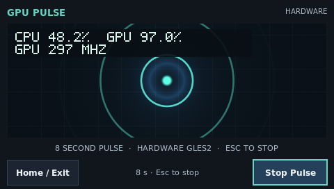

# Platform and app verification — 2026-09-19

Measurements were taken from staged source on `updated-TO-DO`, based on
`6d7dcd6c9ccfd628aeb2fd570d32f3d88104395b`. Working-package validation and
committed catalog release validation are distinct checks.

## Physical platform

PocketCHIP: ARMv7 Allwinner R8, Mali-400/Lima, Linux `6.12.107+deb13-chip`,
Debian 13, SDL 2.32.4, 480×272 at 59.52 Hz. CPU scaling reading 1.008 GHz,
GPU current frequency 297 MHz. Tests ran as the normal `chip` user from staged
source, without changing installed App Center package receipts.

The first moving-rectangle test **failed**: the owner reported massive tearing
even though EGL accepted swap interval 1. The stock X11 session lacked a
compositor. With Picom's XRender backend and VSync, the owner repeated the test
and reported **“No visible tearing”**. The coordinated Shell task instrumented
actual X Present completion: awake display events used FLIP, with approximately
16.8 ms per refresh. Accepted EGL/SDL flags alone were not counted as proof.
Picom runs without shadows, fades, blur or fullscreen unredirect. Session
ownership preserves an existing compositor and cleans up the compositor it starts.

## Measured app behavior

| Measurement | Before | After | Interpretation |
| --- | --- | --- | --- |
| Firefly menu closed, compositor active | 8.09 FPS | 8.63 FPS | 170 particles, same seeded model, six-second runs |
| Firefly menu open, compositor active | 3.58 FPS | 10.01 FPS | Menu no longer causes the previous collapse |
| Debug eight-second Pulse frames | 171 without metrics overlay | 168 with overlay | About 1.8% fewer frames in these short runs |
| Carousel 80 ms GIF average interval | 80.019 ms | 80.005 ms | Media timing preserved |
| Carousel average presentation work | 14.33 ms with original unsynchronized path | 6.80 ms with prepared bytes + compositor | Different backend configuration; not an isolated cache-only comparison |

Firefly profiling found thousands of per-frame glyph rectangle calls and
individual sprite submissions. Text textures now update only when labels change;
a preallocated geometry batch shares a premultiplied atlas while preserving draw
order and artwork. Simulation remains bounded O(n); paused views wait for events.
These short measurements are not precision benchmarks or a 60 FPS claim. The
remaining Python simulation and per-sprite work still limit throughput.

Carousel's clean final sample presented 1,155 frames. Its total 109.54 seconds
used 17.02 seconds of process CPU, including 13.73 seconds of initial decoder
capability checks. Capability probes now run off the Tk thread; their cold start
cost remains noticeable. Cached GIF frames hold prepared RGBA bytes within 8 MiB.
EGL failure converts prepared frames safely for the capped Tk fallback.

Debug's overlay remained visible over the GLES pulse and reported real changing
Lima load (including 95–98% during Pulse) and 297 MHz. Missing/stale metrics show
`--`. The same collector runs in both overlay comparison cases. These results
measure overlay impact; whole-dashboard CPU is not attributed solely to telemetry.

## Implemented requirements

| Requirement | Implementation and validation |
| --- | --- |
| Global rendering contract | Contributor/publishing/build docs and example describe complete backbuffers, one present, backend VSync, and bounded fallback; EGL apps request backbuffer + interval 1; SDL tries VSync backends first |
| Lima permissions/provider | Coordinated Shell service owns a private filtered trace instance; Debug reads `/run/vitrallis-gpu/trace_pipe` using an exclusive reader lock and monotonic sample expiry; root tracefs stays private |
| Debug overlay/keyboard | Small shader-composited metrics texture refreshed once per second; root key bindings preserve navigation when native child surfaces receive focus; panel, scrolling, Pulse and exit regression coverage |
| Experimental Rust | Existing Python manifest/launcher supervises precompiled ELF payloads; architecture, executable mode and path checks; std-only Rust example with asset/icon; staging, inventory, shutdown forwarding and reaping tests |
| Firefly | Profile-guided text caching, reusable ordered sprite batch, VSync selection, event-driven paused behavior; physical before/after above |
| Carousel playback/QR | Prepared-frame cache, media deadlines, bounded fallback, current private-network URL and QR; physical motion and home layout inspected |
| Uploads | Two transfer slots, one expensive validator, per-file progress and retained successes; browser test saved GIF/WebP while rejecting a corrupt third file |
| Folder downloads | Authenticated bounded streamed ZIP, traversal/symlink rejection, unlinked temporary file; original names retained, duplicate basenames placed under unique ID directories |
| Thumbnails | Two browser fetches, bounded subprocess generation, 2 MiB memory cache, first-frame images/animations and FFmpeg video, placeholder on failure |
| FFmpeg capabilities/action | Real bundled VP8, VP9 and WebP inspection + pixel decode; cached readiness; fixed no-argument root helper provisioned by platform setup; background install rechecks support before success |

Collections are flat in the existing library. Download preserves that structure;
it does not invent nested collection support or flatten accepted nested paths.

## Automated checks

Host Python 3.13/macOS: **301 tests run, 298 passed, three skipped**, across
catalog tools (62), Bitcoin (56), Firefly (18), Debug (64), Carousel (91), Python
example (7) and Rust launcher example (3). Logs and command manifest are adjacent.
Two Debug GUI smoke cases require X11 `DISPLAY`; one Carousel EGL integration
case requires the native X11/EGL path. Other Tk layout/lifecycle tests ran on macOS.

At the time of the device tests, all six working packages, the existing four-app
catalog hashes and prior committed changelog history passed validation. That
historical changelog check did not certify the staged releases. Rust formatting, all-feature strict Clippy (including
pedantic/nursery/cargo), and all-feature cargo test passed. The minimal Rust
program has no Rust unit tests; its packaging/lifecycle checks are in Python.

Browser validation covered login, collection creation, simultaneous uploads,
retained partial success, GIF/WebP thumbnails, folder download and real codec
readiness. The 390×844 phone layout was inspected and corrected so filenames
remain readable. No browser console errors were observed.

## Release state and remaining limits

Tested package versions are Firefly 0.3.0, Debug 0.3.0, Carousel 0.2.0,
hello-vitrallis 0.1.1 and experimental hello-rust 0.1.0. Hardware measurements
used staged source; a managed App Center update to these releases was not
physically exercised. No app IDs, catalog schema or Python support were replaced. ARM execution was verified without device Cargo;
foreign-target build success must not be described as physical execution.

## Post-reboot validation

The coordinated normal Shell installation and reboot restored the enabled root
oneshot, GPU devfreq at 297 MHz, and the private `root:chip` mode 0440 trace reader.
The normal user still cannot read the global trace pipe. DTB hashes remained
unchanged on idempotent setup. The desktop automatically restarted Shell and its
owned Picom compositor. The Shell task's detailed evidence is in its
`docs/devices/pocketchip/gpu-utilization.md` and adjacent `evidence/gpu-vsync/`.

Staged Debug passed real X11 event injection for opening/backing out of all five
panels, Page Up/Down, Tab, starting Pulse, Escape while the native child had focus,
and keyboard exit, with no Tk callback errors. Five post-discovery collector
samples used 0.254 seconds of process CPU across approximately five seconds;
this includes all dashboard metrics. At idle the GPU can suspend and stop trace
events, so stale utilization correctly became unavailable while frequency stayed
readable. Separate active-load checks showed changing real utilization.

The example built for all three supported Linux triples using cargo-zigbuild
0.23.2. The ARMv7 payload launched successfully as `chip` from `/` after reboot,
reading its packaged greeting asset. AArch64 and x86-64 were build/ELF-validated,
not physically executed on those architectures.

The installed FFmpeg decoded all three fixtures after allowing for cold process
startup. Five-second probes were too short immediately after reboot; they now
allow 15 seconds each. A requested install performs another real preflight before
any package mutation, and HTTP polling returns the last complete result while
that recheck runs. Real on-device HTTP POST against the compatible system returned
`ready` and skipped the installer. Extra helper arguments were rejected by sudo;
the executable is `root:root` 0755 and the scoped sudoers file is 0440.

The installation branch for missing codecs has automated preflight, bounded
error capture and post-install failure coverage. We did not remove the device's
working FFmpeg just to force a package installation. Capability success, no-op
behavior and provisioning were checked on hardware; missing-package apt behavior
still depends on the configured Debian repositories and their availability.

## Combined platform installation

After the Shell task's handoff, the multimedia helper was added to its normal
bootstrap, installer, receipt/uninstaller and release inventories. The combined
normal-user installation was tested using the existing validated ARM bundle
`5487971547cd91f527b61634b47c34288478f0ab9270d9a48b41732cd3ce7aca` and
fresh current helpers. Receipt-checked removal retained apps, preferences and
documents. Reinstallation provisioned GPU access and the fixed FFmpeg action,
reported no reboot needed, and restarted Shell with its owned VSync compositor.
The installed helper hash matches source; the new uninstall dry-run validates the
receipt and includes that helper. Relevant Shell tests passed: 29 installer and
9 release packaging tests. No Shell version was changed.

Rust staging also rejects even an empty concurrently created destination using
atomic no-replace publication on macOS/Linux; failures leave no partial package.

The [changed-file inventory](changed-files.txt) lists Apps files and the separately
coordinated Shell multimedia files. Shell GPU/provider/presentation changes are
owned and documented by the coordinated GPU task.

Final post-reboot overlay capture confirms CPU 48.2%, real GPU 97.0% and 297 MHz remain visible over Pulse:

